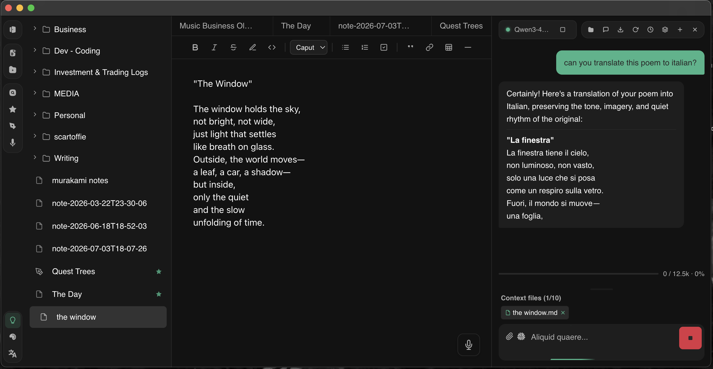

# Leaf 


Leaf is a **local-first, privacy-focused note-taking app** for desktop built with **Electron**, **Vue 3**, and TypeScript. Inspired by Obsidian, Leaf provides a clean, distraction-free environment for managing your notes. All your data stays on your device - no cloud, no database, no tracking.

> **IMPORTANT:** This app runs natively on **Desktop** (macOS, Windows, Linux). All notes are stored in your local vault folder and never leave your device.

# Demo


## Features

### Note Management
- **Vault-based system** - Select any folder as your vault
- **Multi-format support** - Read and edit `.txt` and `.md` (Markdown) files
- **Image support** - View images directly in the app (`.png`, `.jpg`, `.jpeg`, `.gif`, `.webp`, `.svg`, `.bmp`, `.ico`)
- **Video support** - Play videos directly in the app (`.mp4`, `.webm`, `.ogg`, `.mov`, `.avi`, `.mkv`)
- **Audio support** - Play audio files directly in the app (`.mp3`, `.wav`, `.flac`, `.aac`, `.m4a`, `.ogg`, `.wma`, `.aiff`)
- **Audio recording** - Record voice notes directly in the app and save as `.wav` files to your vault
- **File browser** - Navigate your notes with a tree-based folder structure
- **Drag & drop organization** - Move files between folders with drag and drop
- **Folder nesting** - Organize folders by dragging them into other folders
- **Auto-save** - Changes save automatically as you type

### AI Assistant (Local LLM)
- **100% local inference** - Run AI models directly on your machine, no cloud or API keys needed
- **Chat interface** - Built-in chat panel with streaming responses
- **Conversation history** - All chats are automatically saved as JSON and can be browsed, loaded, renamed, or deleted
- **Note-aware context** - Toggle to include the current note as context for AI queries
- **Model management** - Load and unload GGUF models from a dedicated models folder (`~/leaf-models/`)
- **GPU accelerated** - Automatically uses Metal (macOS), CUDA (NVIDIA), or Vulkan for fast inference
- **Powered by llama.cpp** - Uses [node-llama-cpp](https://github.com/withcatai/node-llama-cpp) bindings to [llama.cpp](https://github.com/ggml-org/llama.cpp) (both MIT licensed)

### Privacy & Storage
- **100% Offline** - Works completely without internet connection
- **Local-only** - Notes never leave your device
- **User-accessible files** - Direct access to your vault folder
- **No database** - Plain text files you can open anywhere
- **No tracking** - Zero telemetry or data collection

### Design
- **Obsidian-inspired UI** - Clean, familiar interface
- **Dark mode** - Easy on the eyes
- **Distraction-free** - Focus on your writing

## Security & Privacy

Leaf is built with privacy and security as core principles:

### Privacy Guarantees
- **No telemetry** - We don't collect any usage data, analytics, or crash reports
- **No network requests** - The app works 100% offline and makes zero external connections
- **No cloud sync** - Your notes never leave your device unless you explicitly copy them
- **No accounts** - No sign-ups, logins, or user tracking of any kind
- **Local AI** - AI inference runs entirely on your hardware; no data is sent to any server

### Security Architecture
- **Sandboxed renderer** - Context isolation prevents unauthorized system access
- **Local file system only** - File operations are limited to your selected vault folder
- **No remote code execution** - All code runs locally on your device
- **Open source** - Full transparency - audit the code yourself

### Reporting Security Issues
If you discover a security vulnerability, please open an issue on the [GitHub repository](https://github.com/larrydarko1/leaf/issues). 

## Data Storage

### Your Notes
Your notes are stored exactly where you choose - simply select any folder on your system as your vault. Common locations:
- **macOS:** `~/Documents/Notes/`, `~/Desktop/MyVault/`
- **Windows:** `C:\Users\YourName\Documents\Notes\`, `D:\MyVault\`
- **Linux:** `~/Documents/Notes/`, `~/notes/`

> **Note:** Your vault folder can be anywhere on your system. Use it with other apps, back it up to external drives, sync with git - it's just plain text files!

### AI Models
Leaf stores AI models in `~/leaf-models/`. To get started with the AI assistant:
1. Open the AI panel by clicking the lightbulb icon in the sidebar
2. Click the folder icon to open the models directory
3. Download a `.gguf` model file from [Hugging Face](https://huggingface.co/models?library=gguf&sort=trending) and place it in the folder
4. Select and load the model from the dropdown in the AI panel

Recommended models for getting started:
| Model | Size | RAM Needed | Best For |
|-------|------|------------|----------|
| Llama 3.2 1B Q4 | ~0.7 GB | ~2 GB | Fast, lightweight tasks |
| Llama 3.2 3B Q4 | ~2 GB | ~4 GB | Good balance of speed and quality |
| Phi-3 Mini 3.8B Q4 | ~2.3 GB | ~4 GB | Strong reasoning |
| Llama 3.1 8B Q4 | ~4.5 GB | ~8 GB | Best quality |

### App Settings
Leaf stores minimal app preferences (like your last opened folder path) automatically. No configuration needed.

### Conversation History
AI conversations are automatically saved as JSON files in Electron's standard `userData` directory:
- **macOS:** `~/Library/Application Support/Leaf/conversations/`
- **Windows:** `%APPDATA%\Leaf\conversations\`
- **Linux:** `~/.config/Leaf/conversations/`

Each conversation is stored as a separate `.json` file containing the model used, timestamps, and the full message history. Conversations are auto-titled from the first message and can be renamed or deleted from the history panel.

## Getting Started

### Prerequisites
- Node.js (v18+ recommended)
- npm

### Setup

1. **Clone the repository**
```sh
git clone https://github.com/larrydarko1/leaf.git
cd leaf
```

2. **Install dependencies**
```sh
npm install
```

3. **Run in development mode**
```sh
npm run dev
```

### Building for Production

```sh
# Build for your current platform
npm run build:electron

# Build specifically for macOS
npm run build:mac

# Build for Windows (requires Windows or cross-compilation setup)
npm run build:win

# Build for Linux
npm run build:linux
```

The built installers will be in the `dist-electron/` directory:
- **macOS:** `.dmg` installer
- **Windows:** `.exe` installer (NSIS)
- **Linux:** `.AppImage` file

### Installing the App

After building:
1. Navigate to `dist-electron/`
2. Double-click the installer for your platform
3. Follow installation prompts
4. Launch "Leaf" from your Applications folder

## Tech Stack
- **Desktop:** Electron (Native macOS, Windows, Linux app)
- **Frontend:** Vue 3, TypeScript, Vite, SCSS
- **AI:** [node-llama-cpp](https://github.com/withcatai/node-llama-cpp) + [llama.cpp](https://github.com/ggml-org/llama.cpp) (local LLM inference)
- **Storage:** Plain text files (txt, md), images, videos, and audio in your local vault
- **Build Tools:** Vite + Electron Builder

## Project Structure

```
leaf/
├── electron/
│   ├── main.cjs                # Electron main process
│   ├── preload.cjs             # Secure bridge between main/renderer
│   ├── ai-service.cjs          # Local LLM inference service (node-llama-cpp)
│   └── conversation-service.cjs # Conversation persistence (JSON storage)
├── src/
│   ├── components/
│   │   ├── AiPanel.vue         # AI chat interface with conversation history
│   │   ├── FileExplorer.vue
│   │   └── NoteEditor.vue
│   ├── types/
│   │   └── electron.d.ts
│   ├── App.vue
│   ├── main.ts
│   └── style.scss
├── build/                      # App icons
├── package.json
└── vite.config.ts
```

## Contributing
See [CONTRIBUTING.md](CONTRIBUTING.md) for guidelines.

## License
This project is licensed under the MIT License. See [LICENSE](LICENSE) for details.

## Acknowledgments
- Inspired by [Obsidian](https://obsidian.md/) for the vault-based note-taking approach
- Local AI powered by [llama.cpp](https://github.com/ggml-org/llama.cpp) and [node-llama-cpp](https://github.com/withcatai/node-llama-cpp)

---

**Made with Vue 3, Electron, and a passion for local-first software.**
